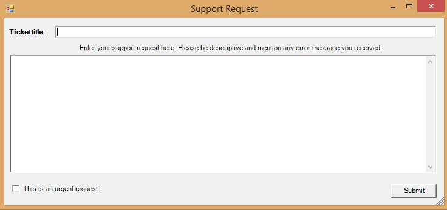

## Support Request for Windows

### Installation

A sample NodePoint ticket client. To try it out, simply download the setup file and run it as an administrator. It will install the binary to your desktop, which will file tickets to [https://nodepoint.ca/nodepoint](https://nodepoint.ca/nodepoint)

To use it in your own NodePoint installation, download the `bin` folder and edit the `install.bat` file with your own settings. This requires .NET Framework 3.5.

**Note:** By default it submits tickets to the demo instance. You will want to modify the source and compile it for your own environment.

#### Sample:

